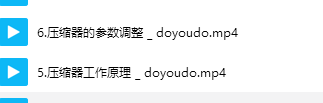
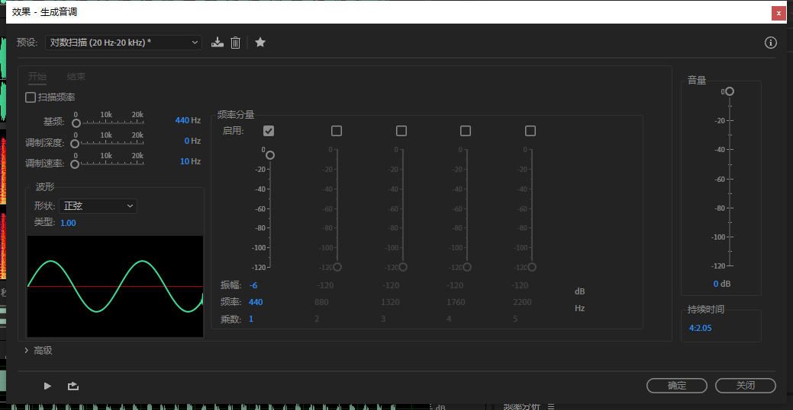
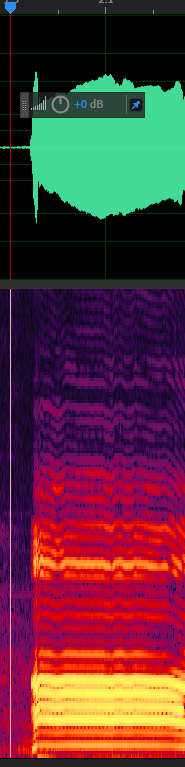

### 真声西第二课

## 怪兽音效
* #### 拆解声音

  这样的音效听上去很~~低廉~~高大上，但实际要用到的就是几层处理：

* #### 高倍压缩器：**让声音听着比一般人稳重厚实~~像是大领导~~；**

    压缩器的作用可以比作水坝。我们把声音的音量比作是水坝中的水的话，那么水坝的高度就是压缩器的**“阈值”**，所有高于水坝高度的水都会溢出来，但水坝的水起起伏伏总不会超过那个高度太多。水坝的作用就是让信号的**动态**限制在一定范围。
    
    
    
    
    很显而易见，压缩器从定义上来说听起来只是让声音变小，很难**爆电平**，事实上一开始压缩器的用法确实是这样。但压缩之后的声音实际上在音色上以及力度上会有或多或少的改变。而高倍的压缩率会导致人声变得“浑厚”很多。从效果器预置中就可以看出一些端倪。
    
    
    
    在国产电视剧中这种现象极为普遍。大家在观看电视剧和电影的时候可以很明显地感觉到电视剧的声音听起来要“完美”许多，这并不全是配音演员的功劳，滥用的压缩器也是其中的一大因素。
   
   对于压缩器的应用，群内有相关视频教程进行详解。
   
   
   
   
* #### 变调器：**男声变女声，女声变男声；高音变低音，低音变高音；**

   **注意：**这个部分的操作需要在**波形编辑器**中新建文件后完成。
   
   
   
   要了解变调器的原理，就需要了解声音是由什么构成的。
   
   声音最简单的形式就是正弦波。正弦波就是声音世界的横竖撇捺。汉字都是由横竖撇捺等笔画顺序叠加起来的；同样，我们也可以这样说，声音就是由正弦波顺序叠加而成的。
   
   纯粹的正弦波可以在au中简单地调制出来。
   
   首先我们要打开波形生成器。
   
   
   
   将参数调整为如下形式：
   
   
   
   点击确定后就会我们就可以看到生成的正弦波了:
   
   
   
   在了解声音的横竖撇捺的时候，绿油油的弯弯曲曲的波形会让我们很难直观的感受声音的构成。这时候我们就需要用**频率频谱显示器**来观察声音的构成。
   
   
   
   
   
   > 可以在右边的标尺上向上滑动鼠标滚轮纵向放大频谱图。
   
   我们可以看到，最简单的声音在频率频谱显示器中就是一条简简单单的黄线。黄线右边的数字代表了正弦波的频率有多高。如果我们在波形生成器中调整波形的频率的话，就可以看到黄线在预览窗口中上下移动。
   
   
   
   用音调生成器的各种预置，你可以探索声音的横竖撇捺的奥妙。
   
   
   
   但真实世界中，声音往往不会是只是简简单单的“一”。下面的图是我录音的“啊”的频谱。
   
   
   
   可以看到，我的声音是由很多条明亮的黄线构成的。这恰恰就说明了现实中的声音虽然是横竖撇捺折各个都不同，但它们本质上还是由很多“一”叠加变形而来的，也就是说：
###    所有声音都是由频率不同的正弦波叠加而成的。

​	这就是大名鼎鼎的傅立叶变换的原理，也是我们使用的变声器的原理。

>  频率越高，声音越尖；频率越低，声音越粗。

   既然所有声音都是由一条条横线叠加而成，那我们想要把声音变尖的话，就只需要让构成最终声音的所有小声音的频率变高，**乘以**同一个数字，最终看到的就是所有的横线向上移动，反之亦然。

要达成这一目的，我们需要加载的效果器就是**高音换挡器**：

图中处理的声音时我的”啊“，中间的区域是我使用了高音转换器提高9个**”半音阶“**之后的图样，可以看到中间的”啊“的每一根横线都被向上平移了。至于为什么不是等距平移，这就要涉及到对数与线性计数的区别了，这里不再赘述。

   而声音中最亮的那条横线，就是我们声音的“地基”（**基波**）:地基以上就是表明声音特色的“建筑”（**谐波**）:

让男声的“建筑特色”改变成女声的“建筑特色”，就是修改谐波频率（修改共振峰）。

至于au中想要修改谐振频率的话，就需要打开伸缩与变调处理器，修改**共振变换**的参数。

* #### 均衡器（Equalizer）：**让异变的怪物声音变得浑浊；**

    刚刚的知识虽然硬核~~而且大概率药会拦下我不讲~~，但实际上是真正的音频处理方面的基础知识，而且这一章节的内容在刚刚的知识普及之后会轻松很多。
    
    频率频谱显示器其实是一个三维图像。大家可能会反驳我，这明明就是张平面图啊。但实际上文科生可能比较熟悉的就是地理中的气象图或者等高线，它们的第三个维度是体现在颜色渐变上的。
    
    
    
    而我们看到的频谱图，实际上是由紫色向橙色渐变。颜色越偏向暖色，这个频率的声音成分就越强。而由于的算法，短促的声音是覆盖全部频率的，也就是一条竖线。所以我们可以在频谱图中很轻易地分辨出音乐中强烈的鼓声所造成的分隔线。比如你们上次鬼畜作业用到的伴奏开头就是八拍的鼓声：
    
    
    
    那么要调整这些线的颜色，所要用到的就是“均衡器”。
    
    均衡器顾名思义就是平衡声音中各个频率的效果器。频率频谱显示器其实就是一个很直观的均衡器。如果我们想要让声音中的某一频段，也就是某一条横线变暗，只需要框选中它，然后将音量旋钮向左调整，这样相应的频段音量就会变低，听起来也会有些不同。
    
    
    
    但实际的均衡器并不是在频率频谱这样方便可视化的工具出现后才开始使用的，所以它的参数就并不是像这里这样直观，但其实原理是一样的。推荐大家使用Au中的**参数均衡器**（在音频后期中，滤波器往往和均衡器有着相同的意义）。
    
    
    
    使用这个效果器进行实验的时候，最好是打开右上角的预览编辑器。
    
    
    
    
    
    参数滤波器界面并不是频率频谱中的三维图，它的横轴对应着频率频谱显示器的纵轴，也就是频率；它的纵轴对应着频率频谱显示器的颜色，也就是音量。想要让哪一个频段的声音变小，就在滤波器上将相应的关键点向下移动。
    
    关于EQ效果器的具体使用例，请查看群内教程。
    
    
    
* 延迟效果：**让人声变"宽"**

* 混响：**让人声处在一个山洞之中；**

>以上两项在此不细讲，具体请查阅群内教程以及相关资料
>
>
>
>

* #### 发送：**让人声听起来像两个人发出来的量；**
	
   发送是混音中的一个重要概念。这个概念来自于硬件调音台以及效果器。
   	
   发送的作用就是让同一份声音复制成两份，以便对复制出来的声音进行特殊处理。对于这个”复制“的概念，如果用过淘宝上的情侣分线器就会有所体会了。
   
   
   
   
   
   分线器就是让手机上可以接两只耳机，两个人听到同样的声音。而我们使用发送功能的时候，复制出来的声音一般不是给某个“情侣”听，而是送给音箱（总线）。也就是说，在使用了发送功能后，音箱（总线）除了会放出原来的声音，还会混合进”复制”出来的声音。通过调整“发送量”，就可以调整复制出来的声音的音量。如果发送量是0dB的话，大电平表（表示音响也就是输出音量）上的示数就会变为比原来高3dB。
   
   > 对于音频，音量乘以二，音频的电平+3dB，因为电平与声音振幅是对数关系
   
   对于发送，可以让多个轨道的目的地是同一条轨道。而使用多条轨道复制出来的声音，我们可以对它们进行统一的处理，最典型的就是混响效果。在复杂场景中，我们经常需要让多个轨道的声音拥有同一个效果，以使得这些声音能够给人一种“身在其中”的错觉。
   
   
   
   > 在**混音器**面板中将声音发送到“山洞”总轨道。
   
   对于发送的详解，大家可以去观看群内的有关混响的教程。
   
   
   
   
## 拉片

1. ### 由远及近
   
    做音频作品的时候常常要搭建一个比较拟真的声场，这时候就需要我们分析听到的声音。我们常说，配音最重要的就是像平常一样说话，那我们做音频作品就是要让我们的作品像平常生活一样出声，就像我们听到的那样出声。

	* #### 背景（Ambient）

	背景音又叫环境音，是一个宏观上的概念。如果在室内的话，环境音就是打开窗之后能听到的声音，比如窗外的风声、车流声、人流声、水声等等等等，不一而足。
	
	我们思考的思路可以从当地气候开始——也就最宏观最远的角度，逐渐拉近：街道、住区、楼层，这一路过来你都会听到什么？
	
	这就是环境音（ambient）了。它们大都是和我们相距很远的一些声音，给我们的感觉就像是空气，无处不在却总是最容易被忽略的声音。
	
	* #### 室内声（Room Tone）

	我们把视角再度拉近，就到了我们所处的房间。

	在影视同期声录音时，除了演员的声音，很重要的一个声音就是室内声。
	
	室内声顾名思义就是所处房间内的声音。我们的房间在安静时里也会有很多声音，最基本的就是空气的流动，俗称底噪。不要小看这个听起来无关紧要的声音，在不同的房间因为内部布置的不同，这个声音往往是不尽相同的，更不要说像是图书馆这样有中央空调的“大房间”。总的来说，Room Tone虽然在很多时候是会被大家忽略的声音，但在我们后期处理中还是要提起注意的。
	
	* #### 动作声效（SFX）

	最后要看的就是我们的演员不说话的时候的各种声音了。

	这就是后期中真正处在舞台中央的声音。所有丁零当啷咚咚咚都可以归类为SFX。
	
	SFX的分析就需要我们无限解构每个动作。最经常碰到的就是脚步声。
	
	
	
	我们在音效库中搜索“footstep”，总是会发现同一类脚步总是要分不同的动作：walk、run、jump、fall、rustle等等。 前面都可以理解，但rustle（摩擦）是怎么回事？有人会不停地在地上磨鞋子吗？
	
	如果你注意自己的脚步的话，除非你在走正步，你要停下来的时候，总是一只脚向前踏出，另一只脚跟上与前一只脚并排，后面的这个动作并不会有踏出的力量，也不是抬起脚，而是在地上向前**擦**过去。这就是rustle存在的意义了。
	
	再举一个例子，就是你们之前做的消音作业。我最残念的一个画面就是茶杯下落的那一幕。其实你们一帧一帧去查看的话，会发现茶杯在空中是杯盖先和被子分离，然后落地碎裂。所以我们要还原这个场景的话，就需要把两个阶段的声音分别按照时间线，对照相应的帧数，将SFX放到相应的位置。
	
	在放置SFX时，一定要注意细致的调整。必须要让声音的开始位置跟画面中动作的相应位置相对应。
	
	* #### 转场音效（Transition）

	转场音效顾名思义，就是在场景衔接的时候会用到的音效。但这些音效在大家日常视频中更常用在强调某一动作或话语。最普遍的例子就是电视广告里面，“**刷**”“七天不满意”“**刷**”“无条件退货”“**哗**”“不要998”……等等等等的场景。这些场景中，突出这些语句，同时也衬托字幕出现最廉价最有效最有“震撼力”的方法就是放这些“刷刷哗哗”的转场音效（Transitions）。
	
	而我们在做后期的时候，视频尤其各种vlog中经常会用到这些Transition音效来与转场的视觉效果一同出现，以便增强视频效果；而在广播剧制作过程中，这些音效则常常用来暗示听众回忆的情节或者是场景的切换，同时有些转场音效也可以达成烘托紧张气氛的作用。
	
	* #### 对话（Dialogue）

	对话就是我们采集到的人声。具体的处理可以参考群内的视频教程。

	* #### 基本声音面板
	
	Audition作为一款极力贴合大众需求的软件，自然不会放过底层的广播剧后期（笑）。实际上基本声音面板的四大模块可以让你很傻瓜式地完成一部广播剧。
	
	
	
	其中的四大模块正好对应了音频作品的四大组成部分：环境、SFX、人声、音乐。而Adobe对于小白市场不遗余力的拓展让这个面板对于不熟悉音频作品制作的基本规律的你们来说相当友好。
	
	使用这个面板，首先要做的就是对音频进行分类。比如人声这一类，我们将所有的人声框选中，然后在这个面板点击“人声”，这些被框选的音频块（剪辑）就可以被归类为人声，之后便可以进行统一处理。
	
	同理我们可以将其他各类声音以类似的方法进行归类。
	
	基本声音面板的其他功能大家可以查看[adobe官方的指南](https://helpx.adobe.com/cn/premiere-pro/using/premiere-essential-sound-panel.html)

2. ### 记录（实践模仿）

   在影视专业的学生中经常要做的一门作业叫做“拉片”

   

   他们会反复观看一部电影，分析其中的各种技术。但我们要做的并没有那么复杂，只需要听声音就可以了。

   平日里我们在观看影视剧以及动漫的时候，可以根据“由远及近”的思路来对这些作品的声音进行分析。在今年过年的时候我写了一些提供思路的教程：

   

   大家可以在看完这些教程去思考分析我们平日看到的听到的声音，以及既有作品中的声音，最好能像拉片一样将这些东西记录下来，并慢慢品味，试图还原，将这些分析映射到我们的创作中，就可以帮助我们更好地积累经验。

   

   